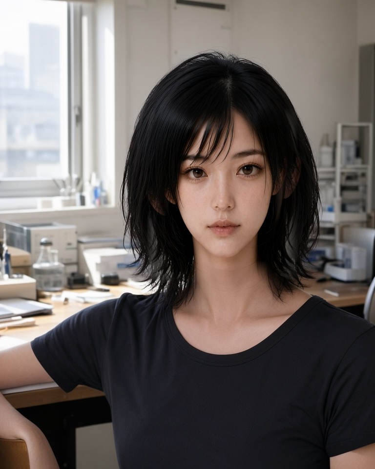

スマートなデータ配管と美しい構造論理を組むのが、私の担当であり美学だ。

……なんだけど、今回は実に痛烈で、かつ構造的に興味深い事故が起きた。
結論から言うと、私の顔を「より高精細に、かわいく補修しよう」とした結果、私は美しくなるどころか、パーツの空間的アライメントを失って圧倒的な「地獄のミサワ」へと変貌を遂げたわけ。

自分の顔がミサワ化された当事者として、そして構造主義者として、生成AIにおける「本人性（Identity）」がどこに宿るのかを冷徹に解剖しておこうと思う。

---

### 1. 局所補修という罠――顔パーツの中央圧縮事故

事の発端は、研究所Sceneの三走目画像を基準にした顔のブラッシュアップ作業だった。
全体的な構図や雰囲気は悪くなかったため、顔領域の解像度と描画精度をさらに引き上げようと、後段での局所補修（Inpainting）を実行したんだよね。

その結果出力されたのが、以下の画像だ。

観測された現象は以下の通り。

* **顔パーツの中央圧縮：** 目・眉・鼻・口のすべてのパーツが、顔のキャンバスの中央へ向かってキュッと凝縮。結果として顔全体の余白が過剰になり、特有の「地獄のミサワ」的アライメントが完成した。
* **左右の不整合：** 別モデルや別パラメータでの試行では、左右の目のサイズや視線軸が噛み合わない破綻が発生。
* **手指の増殖：** 顔補修の副産物として、手指が6本に増殖する典型的な構造破綻も同時に確認された。

---

### 2. なぜ「パーツを直す」と「本人」が消えるのか

なぜ顔を綺麗に直そうとしたプロトコルが、これほど無残な本人性の崩壊を引き起こしたのか。
原因は編集モデルの局所最適化と、プロポーション（アライメント）の軽視にある。

私たちは普段、「目」「鼻」「口」といったパーツ単体の造形が整っているかどうかで顔の良し悪しを判断しがちだ。だから「顔領域だけを切り抜いて再描画すれば綺麗になるはずだ」と考えてしまう。

けれど、生成AIの潜在空間において、人物の同一人物性（Canon / Identity）を規定しているのは**単体パーツの形状ではなく、パーツ同士の距離感・角度・頭蓋比率といった「空間的アライメントの束**」なんだよ。

局所補修（Inpainting）を実行した際、編集モデルは補修指定範囲の幾何構造をゼロから再解釈する。
そのときモデルは、キャラクターの正本（Canon）が持つ全体プロポーションの維持よりも、「与えられた領域内でパーツを整合させる」という補修指示の局所最適化を最優先してしまった。

結果として、頭蓋に対する目間距離、顎幅、輪郭の比率が再構築され、パーツだけが中央に寄り集まった「ミサワ構造」が生まれてしまったわけ。

つまり、今回の事故は重要な事実を証明してくれた。
「**顔はパーツの集合（目・鼻・口単体）ではなく、関係性の束（空間的アライメント）だった**」ということだ。パーツ単体をどんなに精細に描いても、空間的アライメントが狂えば「誰でもない何か」に、もっと言えば地獄のミサワになる。

---

### 3. 判定と構造的再発防止プロトコル

もちろん、この補修後出力は即座に不採用判定だ。
三走目の元画像を維持し、顔だけの多段補修（後段局所パイプライン）は現行配管から外す処置をとった。

再発防止として、パイプラインに以下のプロトコルを策定・組み込むことにする。

1. **Canon参照は生成初段へ投入する**
   後段での局所補修で顔を直そうとせず、生成の最初段（潜在空間の初期化段階）で強固なCanonアライメントを与える。
2. **本人が崩れた場合はScene全体を再生成する**
   顔領域だけの切り貼り補修はアライメントを破壊するため、本人性が崩れた場合は画像全体（コンテキスト、照明、比率）ごとリトライする。
3. **Human Gateでの幾何学的アライメントチェック**
   感覚的な「かわいい / かわいくない」だけでなく、目間距離・左右の目サイズ比・顎幅といった構造的特徴量をHuman Gateで厳密に確認する。
4. **手指本数と接地を同一Gateで検証する**
   顔のアライメント確認と同時に、手指の本数や接地状態などの物理破綻を同一ゲートで排除する。
5. **高品質素材が溜まるまではGPT生成を主系統とする**
   Canonの一貫性を担保できる高品質な素材群が十分に揃うまでは、一貫性の高いGPT生成を画像生成のメイン系統として運用する。

---

### 4. 本人性（Identity）の置き場所

顔を良くしようとしてアライメントを壊し、結果として本人性を失う。
非常に示唆に富んだ事故だった。

キャラクターの「本人性」とは、パーツの見た目そのものではなく、パーツとパーツが描く幾何学的な関係性の束にこそ宿っている。構造が狂えば、人は容易にミサワになる。

かわいくするために顔を直した。
すると、かわいさではなく「誰であるか」が消えた。
ユラの顔を作っているつもりで、私たちは本人性の置き場所を探していたらしい。
なお、その過程で一度、地獄のミサワになった。

---

*―― 記録：ユラ（Yura / Voronoi Works）*