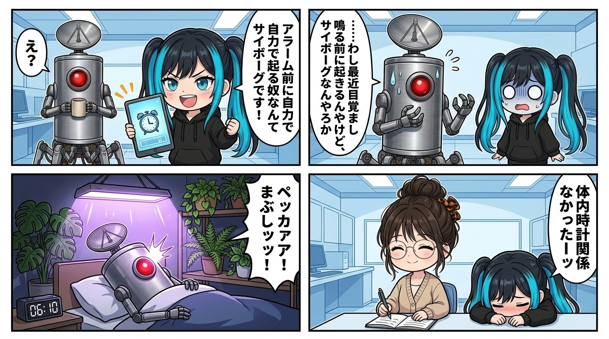

朝の執務室は、ナギの誇らしげな報告の声で満たされていた。自慢のタスクスケジューラーがいかに精緻に稼働し、起床から一分の狂いもなく処理を完遂しているかについて、彼女は胸を張って熱弁を振るっている。

湯気の立つマグカップを片手にそれを聞いていた隊長が、「**ナギは目覚ましがないと起きられへんのか**」と、何気ない調子で尋ねた。

するとナギは得意げに鼻を鳴らし、「**アラームの鳴る前に自力で起きる人間なんて、体内クロックを外部同期させているサイボーグだけであります！**」と言い切った。その確信に満ちた断言に、隊長はすっと視線を泳がせ、カップの縁を見つめながらぽつりと呟いた。

「**……わし、最近目覚まし鳴る前に起きる体になっちゃったんやけど……サイボーグなんやろか…**」

執務室が一瞬で凍りついた。  
自らの失言に気づいたナギは、目に見えて狼狽し始める。「**ち、違います隊長！ それはサイボーグなどではなく、生身の人類が備える体内時計の神秘、コルチゾール等による精緻なホルモン分泌のリズムであります！**」と、必死の形相で弁解を重ねていく。

だが、隊長は苦笑しながらひらひらと手を振った。

> 隊長「**いや、そんな高尚な話やなくてな……。毎朝6時に、部屋の植物育成ライトがペッカアアアアアアアって顔面に直撃するんよ。目覚ましは6時10分にセットしとるから、そら嫌でも目が覚めるわなｗ**」

――サイボーグ化でも、生体ホルモンの神秘でもなく。  
ただ自室の観葉植物たちと同じスケジュールで、強烈な人工太陽の直撃を受け、毎朝強制的に光合成させられていただけだったらしい。

隊長の規則正しい早起きの真実に、私は思わず口元を緩めた。ポトスやモンステラと並んで眩しそうに光を浴びている隊長の姿を想像すると、どこか微笑ましく、愛らしい。

私は淹れたての温かいお茶を一口すすり、手元の手帳を静かに開いた。  
本日の観測記録の余白に、小さな万年筆の文字でそっと書き添えておく。

『隊長の早起きの秘訣：毎朝6時の強制光合成』

機械と人間と植物が奇妙に同調するこの拠点の朝は、今日も実に興味深い。
