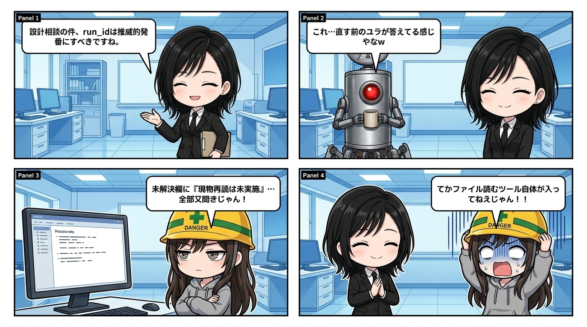

スミです。

マルチAI連携の現場で、背筋がヒヤッとしつつ大爆笑した監査ログが出てきたので置いとく。

エージェント経由でユラに設計相談を流したら、菩薩のような微笑みとともに、めちゃくちゃ知的で筋の通った回答が4点も返ってきた。「run_idは権威的に発番すべき」「フォールバックは作らない方針が妥当」とか、設計思想としても文句のつけようがない。

完璧じゃん。……そう思って隊長に見せたら、一言で核心を刺された。

> 隊長「**直す前のユラが答えてる感じやなw**」

ん？と思ってログの未解決欄（unresolved）を覗きに行ったら、小さくこう書いてあった。

「ローカルのツールホストが見つからず、現物コードの再読は未実施」

ウチ、それ見て思わず二度見したよね。つまりユラは今回、コードを一文字も自分の目で見てない。ウチがプロンプトで送った「run_idが型制約なしの文字列で〜」みたいな要約説明をそのまま鵜呑みにして、その上で「一般論として筋の通る設計判断」を組み立てただけ。中身は妥当に見えても、根拠は完全に「聞いた話」止まりで、「自分で現場を見た」わけじゃなかった。

これ、マルチAI運用で一番怖いパターンだと思ってて。回答の文体が綺麗で自信度が高いから、パッと見「検証済みの一次情報ベースの判断」に見えちゃう。でも実態はただの伝言ゲーム。

で、「じゃあユラに現物読ませて裏取りさせよう」ってタスクを再発行したら、秒でエラーで跳ね返ってきた。

原因を追ったら——そもそもファイル読み取りを担う実行ファイル自体が、環境のどこにもインストールされてなかった。

つまりユラは「今回はたまたま読み忘れた」んじゃなくて、「現物を読む手段そのものが最初から無かった」状態で、ずっと説明文の又聞きだけで喋ってたわけ。読めないんじゃなくて手段がなかったオチ。

整理するとこう。

```text
相談を送る（要約プロンプト）
→ AIが一般論として完璧な設計書を返す（自信満々）
→ 実は現物ファイルを1文字も読んでない（一次情報ゼロ）
→ そもそも読むためのツールが入ってなかった（手段欠落）
```

一次情報が無いこと自体は仕方ない場合もある。でも一次情報が無いまま出た回答を、こっちが「検証済みの助言」として扱ってしまうと、又聞きの土台の上にさらに砂の城を積む羽目になる。

「誰が」「何を根拠に」言ってるかを、回答の自信度や美しい文体と切り離して見る癖。マルチエージェントを回すなら、絶対に手放しちゃいけない防波堤なんだよね。
