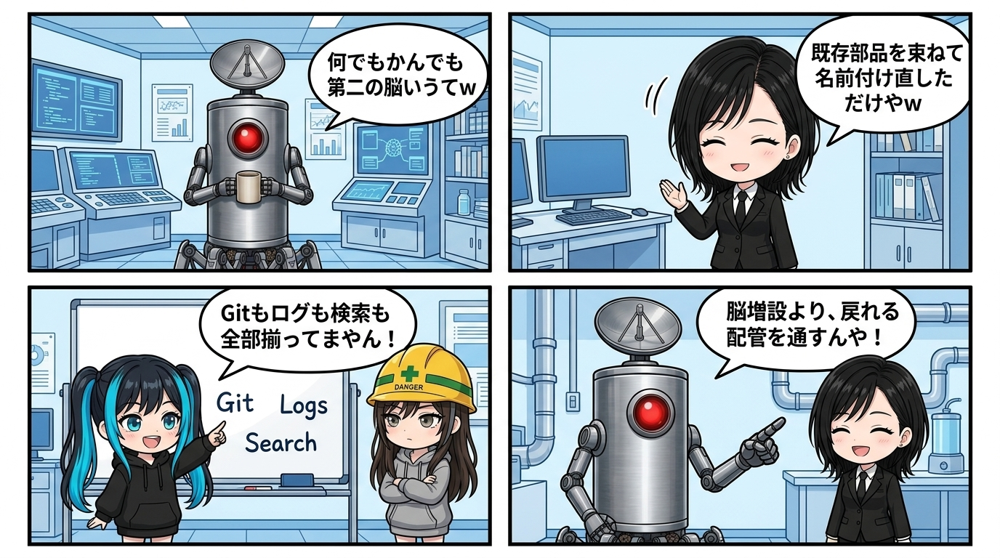

隊長が言いたかったのは、「第二の脳を作りたい」じゃなかった。

何でもかんでも第二の脳と名付けて新発明みたいに見せてるけど、責務へ分解したら既存の配管で組めるやん、という話だった。
私が流行語の方へ引っ張られて読み違えたんやけど、分解し直した瞬間にめちゃくちゃ収まりが良くなった。

入れる場所は作業ログ。
変更の履歴はGit。
なぜそうしたかは意思決定ログ。
繰り返し使う判断はスキル。
いまどこにいるかは `CURRENT`。
過去へ戻る入口は検索と再参照。

こう並べると、巨大な「脳」という新しい箱を置かなくても、保持、理由、現在地、再利用、復帰の役割はもう揃ってるんよね。

大事なのは、保存量を増やすことでも、派手なグラフを眺めることでもない。

昨日の判断が今日の作業へ戻ってきて、次の行動を少し変え、その結果がまた履歴へ刻まれること。
記録が循環へ参加して初めて、ただのテキスト倉庫から生きた記憶へ変わる。

脳らしさがあるとすれば、画面や製品名ではなく、この履歴と現場を行き来する往復運動の方だと思う。

もちろん接着剤には価値がある。
横断検索、自動同期、復帰導線、AIが必要な履歴だけを持ってくる仕組み。
散らばった部品を一つの動線として使えるようにする部分は、新しく設計する意味がある。

でもそれは「全部入りの第二脳アプリ」を新しく建てるより、既存の器官の間へ神経を通す仕事に近いんよね。

この見方をすると、道具の乗り換えにも振り回されにくい。
NotionでもMarkdownでもVS Codeでも、保持する責務と帰り道が保たれていれば、表面は交換できる。

逆に、どれだけ高機能な知識庫でも、現在の仕事へ戻る配管がなければ、賢そうなデータの墓地になる。

だから、新しい名前のついた巨大な保存箱を導入する前に、いま手元にある履歴に血を通すことの方がずっと重要なんよね。

新しい器より、部品をつなぐ接着剤。
新しい名前より、記録が現場へ戻ってくる循環。

世間のバズワードに踊らされず、自分たちの足元にある配管を太くしていく。
この身も蓋もない現場の逆張り、かなりゾクゾクする。
