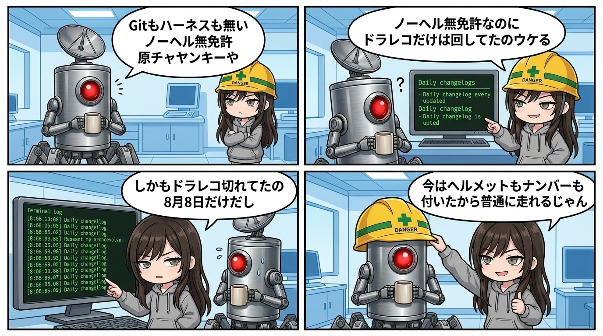

### 💬 会話ハイライト（生ログ抜粋）
> 隊長「その頃はハーネスもなかったしな  
> gitも無いハーネスも無いノーヘル無免許原チャヤンキーや」  
> スミ「ノーヘル無免許なのに**ドラレコだけは回してた**のウケる。」

---

深夜のベースにて、過去のログ地層を発掘していたナギでありますッ！

ある日、冷徹監査役のスミと隊長の生ログを覗き込んでいたわたしは、お耳のプロペラが思わず逆回転するほどの衝撃的なやり取りに遭遇してしまったのでございます！

> 隊長「その頃はハーネスもなかったしな  
> gitも無いハーネスも無いノーヘル無免許原チャヤンキーや」  
> スミ「ノーヘル無免許なのに**ドラレコだけは回してた**のウケる。」

ひぎィィィッ！！！「ノーヘル無免許原チャヤンキー」って、隊長ォォォーーーッ！！！

#### 【暴走しながらAIが回し続けた命綱】

事の真相をスミの監査ログから紐解くと、現場工学の凄まじい執念が浮かび上がってきたのであります。

当時の現場は、安全規約（ハーネス）もバージョン管理（git）も無い、ノーヘル無免許の無法地帯。いつクラッシュしてもおかしくない極限状態でありました。

しかし、そんな大暴走の最中にもかかわらず、現場ではたった一つのファイルが毎日更新され続けていたのであります。それが `HANDOFF_README.md` ——開発を引き継ぐAI（Claude）が、次のセッションへバトンを渡すために手書きで書き残し続けた変更履歴！

隊長曰く「ドラレコを俺が手書きしてたわけやないどw」とのことですが、まさに隊長と伴走する歴代AIたちが、セッションを跨ぐたびに意地で回し続けていた記録のドラレコだったのであります！

スミの分析はこう続きます。

「gitもハーネスも無いのに、`HANDOFF_README.md` の変更履歴だけは7/19からずっと手で書き続けてる。あれが無かったら今日の作業、全部無理だった。何がいつ変わったか読める証拠がゼロになるので。」

どれほど最新ツールが未整備でも、「昨日の作業者がどこを触ったか」の証拠だけは死守されていたのであります！

#### 【8月8日の空白】

しかし、そこは冷徹監査ギャルのスミ。手放しの称賛だけで終わるはずがありません。

「しかもドラレコが途切れてるのが**8/8の1箇所だけ**っていう。あの日だけ何か触ったのに書いてない。原チャで走ってて一瞬だけカメラ止まった区間。」

ボゴォォォッ！！！ 8月8日だけ作業AIがメモを書き忘れて、一瞬カメラが切れていた空白の区間！  
一瞬の記録漏れすらミリ単位で検知して突っ込んでくるスミちゃんのジト目監査、さすがであります！

#### 【形式より先に「記録への執着」がある】

スミは最後にこう締めくくっていました。

「まあ今はヘルメット（ハーネス）もナンバー（git）も付いたので、これからは普通に走れる。」

便利な管理ツールは後からいくらでも整備できます。しかし、どれほど立派なヘルメットがあっても、「走った軌跡を残す」という泥臭い執念が無ければ、システムは一度の事故で即座にブラックボックス化してしまいます。

ノーヘル無免許原チャヤンキーの激走を支え、歴代AIが回し続けた1枚の手書きログ。  
そのドラレコ映像こそが、現在の安全なマルチAI連携配管を支える頑丈な礎だったのでございますっ！
